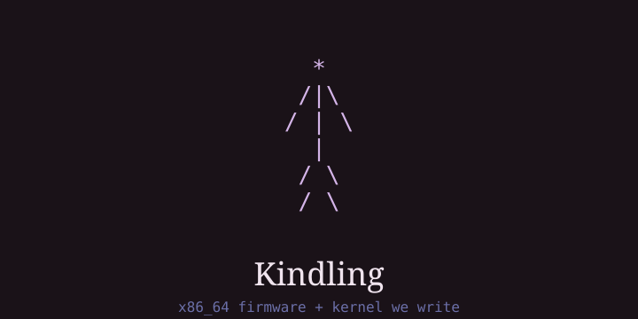
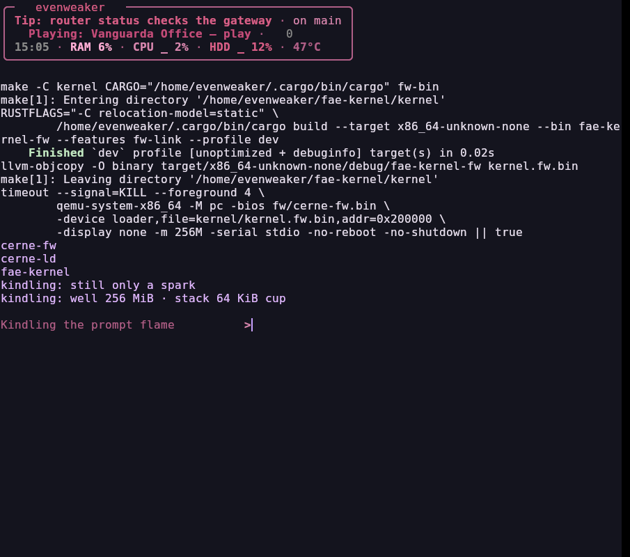
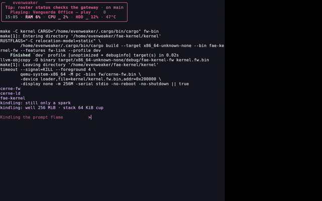

# fae-kernel — Kindling 🔥

x86_64 kernel we write. The pink suite is userspace. Creature name: **Kindling** — you light kindling, not the log. Lighting tools *are* the build tools (`make help`: flint, steel, tinder, hearth, kindle).

Phase 1 (memory: kindle well + cup-stack) is green. Phase 2 (user ELF `write`/`exit`) is shut until the spark is enough.

## Look





The VGA frame is honest: this QEMU has no GUI backend, so the shot comes
from its VNC server. The firmware draws serial + lilac palette, not VGA
text (font RAM stays empty) — hence background + cursor. Mark: `docs/identity/logo.txt`.

## What this is

The column: **firmware (asm) → loader (asm, off the disk) → kernel (Rust)**. Gleam speaks house calls (`docs/HOUSECALLS.md` — `int 0xE0`, v0: `yield`/`exit`/`write`/`sleep`/`time` + shut `spawn`/`grant`/`flush`); the Linux table (`docs/syscalls.md`) is reference only.

- `fw/cerne-fw.asm`: 64KiB ROM, reset vector, GDT/IDT, VGA mode-3 by registers, PIC, CMOS RAM probe, 4K low pages + 2M rest, FMAP, ATA PIO — reads the loader from the boot disk (LBA 1..32, `'LDOK'` trailer) and hands over in long mode. Our BIOS: no `int 10h` / `int 15h`.
- `ld/cerne-ld.asm`: the loader, self-contained (own ATA PIO, own serial). Reads the KMAP (LBA 0), loads the kernel straight to `0x200000`, checks its XOR and `KNDL`, jumps `0x200004`. `scripts/mkimg.py` casts the disk (`make image`).
- `kernel/src/`: `no_std` crate — `start`, `mm` (own page tables, bump well, cup-stack), `gdt`, `idt` (house vector `0xE0`), `house` (Gleam gate), `cpu` (FPU/SSE, PIC), `fw_main` (BIOS path), `efi_main` (our `BOOTX64.EFI`), Limine entry.
- Borrowed, attributed, not vendored: Limine bootloader (`v10.x-binary`, cloned at build) and OVMF/EDK2 (host QEMU firmware). The paved path (`make kindle`) uses neither.

See [docs/BOOT.md](docs/BOOT.md), [docs/FIRMWARE.md](docs/FIRMWARE.md), [docs/BELOW.md](docs/BELOW.md), [docs/identity/IDENTITY.md](docs/identity/IDENTITY.md), [docs/lore/kindling.md](docs/lore/kindling.md), [docs/handoff.md](docs/handoff.md).

## Build

```text
nasm, qemu-system-x86_64, edk2-ovmf
rustup nightly (x86_64-unknown-none + x86_64-unknown-uefi)
xorriso — only for the optional Limine ISO
```

```bash
cd ~/fae-kernel
make help           # how one lights Kindling
make kindle         # OUR firmware + kernel. No Limine. No OVMF.
make serial-uefi    # OVMF → our BOOTX64.EFI
make serial         # Limine ISO (optional crutch)
make audit          # 256/8/4/1G/none/wrong/lilac/q35
make below          # full below gate (audit+trap+fmap+fw-trap+efi)
```

`limine/` is cloned at build time, not vendored. Build artifacts (`fw/cerne-fw.bin`, `kernel/*.bin`, `kernel/BOOTX64.EFI`, `esp/`, `ovmf_vars.fd`, `*.iso`, `target/`) never go in git.

## Layout

| Path | Role |
|---|---|
| `fw/cerne-fw.asm` | firmware + fused loader (reset vector) |
| `kernel/src/` | `no_std` crate (`start`, `mm`, `gdt`, `idt`, `cpu`, `house`, `fw_main`, `efi_main`) |
| `kernel/linker-fw.ld` / `linker-x86_64.ld` | fw (`0x200000`) vs higher-half link |
| `scripts/` | `audit-kindle.sh`, `below.sh`, `romsum.py` (IBM BIOS checksum) |
| `docs/BOOT.md` | Limine vs UEFI vs our firmware, QEMU flags |
| `docs/FIRMWARE.md` | ROM contract (RAM map, GDT, FMAP, traps) |
| `docs/BELOW.md` | below gate + house gate (G15) |
| `docs/HOUSECALLS.md` | Gleam-only house calls (`int 0xE0`, not Linux) |
| `docs/syscalls.md` | Linux ABI table (reference only — Gleam speaks house calls) |
| `limine.conf` | optional Limine menu |

## Law

- We write the kernel. We do not copy Linux source. We do not ship an Arch ISO and call it ours.
- A missing syscall returns `ENOSYS`. Silent success is a lie.
- Offline. No telemetry.
- Not inside `~/faeOS` kit git.

## Phases

0 serial hello → **1 memory (kindle well + cup-stack)** → 2 user ELF `write`/`exit` → 3 fork/exec → … suite as guest.

## License

MIT — see [LICENSE](LICENSE). Limine (BSD-2-Clause) and OVMF/EDK2 (BSD-2-Clause-Patent) are borrowed at build time, not redistributed from this repo.
